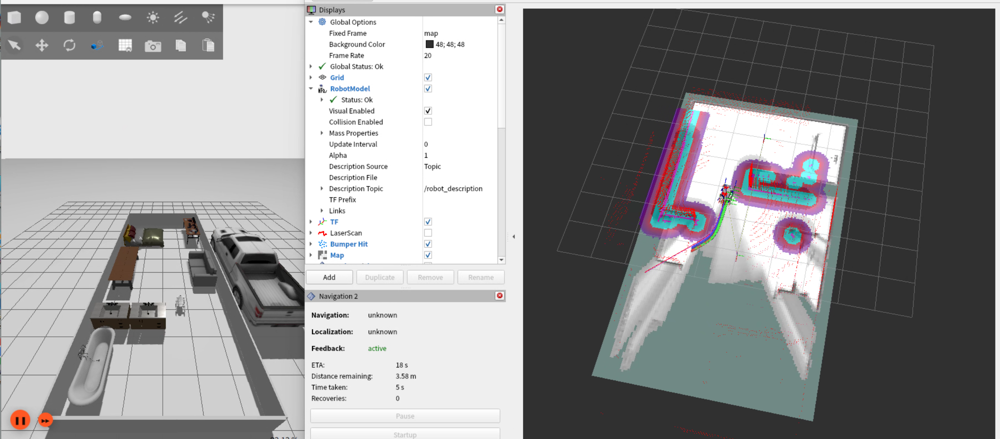

使用champ开源算法,实现智元机器狗d1的ign-gazebo仿真和导航
===
## 使用方式
- 克隆本仓库
```bash
git clone https://github.com/chiway-luo/ign_robot_dog.git -b ign_robot_dog_Agibot
```
- 安装依赖
```
sudo apt install ros-humble-ros-gz               # ign-gazebo仿真 (ros_gz_sim / ros_gz_bridge)
sudo apt install ros-humble-gz-ros2-control      # edu.urdf 使用的 gz_ros2_control-system 插件
sudo apt install ros-humble-ign-ros2-control     # champ.urdf 使用的 ign_ros2_control-system 插件
sudo apt install ros-humble-ros2-control
sudo apt install ros-humble-ros2-controllers
sudo apt install ros-humble-gazebo-ros2-control  # champ_gazebo 编译依赖
sudo apt install ros-humble-gazebo-ros-pkgs      # champ_gazebo 编译依赖
sudo apt install ros-humble-xacro
sudo apt install ros-humble-robot-localization
sudo apt install ros-humble-navigation2          # 导航
sudo apt install ros-humble-nav2-bringup
sudo apt install ros-humble-cartographer-ros     # 建图
sudo apt install ros-humble-velodyne
sudo apt install ros-humble-velodyne-gazebo-plugins
sudo apt install ros-humble-velodyne-description
sudo apt install ros-humble-teleop-twist-keyboard # 手动控制(可选)
```
- 编译
```bash
cd ign_robot_dog
colcon build --symlink-install
source install/setup.bash
```
> 注意: 如果 shell 中激活了 conda/miniforge 环境,请先执行 `conda deactivate` 再编译,否则 ament 会误用 conda 的 python 导致 `No module named 'catkin_pkg'` 错误
>
> 注意: 请在仓库根目录下启动 launch 文件 (launch 中设置的 `IGN_GAZEBO_RESOURCE_PATH=ign_models` 为相对路径)
- ign_gazebo节点 + 导航(包含cartographer)
```
ros2 launch sim_ign_dog d1_gazebo_sim_dog.launch.py 
```
> 考虑到稳定性启动的问题,按依赖启动耗时较长(预计10s),请耐心等待;如启动失败请调节urdf中的激光雷达线束数量
- [urdf 第1019行](src/sim_dog/edu_description/urdf/edu.urdf)


- 控制节点(没必要,除非需要手动控制机器狗)
```
ros2 run teleop_twist_keyboard teleop_twist_keyboard
```

## 参考仓库
- [anujjain-dev/unitree-go2-ros2](https://github.com/anujjain-dev/unitree-go2-ros2.git)

- [chvmp/champ](https://github.com/chvmp/champ.git)

## 开发参考
- 基坐标系 base_link
- 雷达坐标系 laser_up

## 问题描述

> 当前在部分环境下,由于显卡与ign_gazebo的兼容性问题,会导致仿真环境无法正常启动,导致虚拟机崩溃

### 解决方案
参考 [ssh端口转发](https://github.com/chiway-luo/ssh-x11-forwarding-guide.git) , 将仿真环境部署在远程服务器上,通过ssh连接进行仿真环境的使用